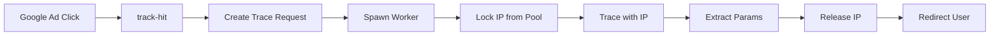

# Quick Start: Parallel Tracing System

## What This Solves

**Problem**: Google Ad clicks arrive with unique tracking parameters (gclid, fbclid, etc.) that must be traced through redirect chains in real-time. Clicks can overlap, and offers may have gaps between clicks.

**Solution**: Over-provisioned IP pool with parallel workers. Each click gets a dedicated IP address, enabling simultaneous processing without conflicts.

## 5-Minute Setup

### 1. Database Ready
The database migration has already been applied with these tables:
- `ip_rotation_pool` - Available proxy IPs
- `active_trace_requests` - Currently processing traces
- `ip_pool_statistics` - Performance metrics

### 2. Provision IPs

**Option A: Quick Test (10 IPs)**
```sql
-- Run in Supabase SQL Editor
INSERT INTO ip_rotation_pool (ip_address, ip_port, country, provider)
SELECT
  'luna-us-slot-' || generate_series(1, 10),
  '7000',
  'us',
  'luna';
```

**Option B: Production Scale (150 IPs)**
```bash
# Install dependencies
npm install @supabase/supabase-js

# Run provisioning script
node scripts/provision-ips.js
```

This creates:
- 50 USA IPs
- 20 UK IPs
- 15 Canada IPs
- 10 Australia IPs
- 5 Germany IPs

### 3. Configure AWS Proxy

Make sure your AWS proxy service (EC2) is updated to accept `proxy_ip` parameter:

```javascript
// In your proxy-service/server.js
app.post('/trace', async (req, res) => {
  const { proxy_ip, proxy_port } = req.body;

  // Use the specific IP from the pool
  const proxyUrl = `http://username:password@${proxy_ip}:${proxy_port}`;

  // ... rest of trace logic
});
```

### 4. Test It

```bash
# Single request
curl "https://your-project.supabase.co/functions/v1/track-hit?offer=test-offer&gclid=abc123"

# Concurrent requests (simulates 10 simultaneous clicks)
./scripts/test-parallel-tracing.sh
```

## How It Works



### Real-Time Flow

1. **User clicks ad**: `?offer=summer-sale&gclid=abc123&fbclid=xyz789`

2. **track-hit receives request** (< 100ms):
   - Creates trace request in database
   - Spawns parallel worker (async)
   - Waits up to 10 seconds for result

3. **Worker processes trace** (5-15 seconds):
   - Locks available IP from pool
   - Calls AWS proxy with dedicated IP
   - Traces redirect chain
   - Extracts final URL params
   - Releases IP with 60s cooldown

4. **User redirected** (total 5-15 seconds):
   - To final URL with inbound + extracted params
   - Example: `final-url.com?gclid=abc123&clickid=extracted123`

## Concurrent Handling

### Example: 10 Simultaneous Clicks

```
Click 1 → Lock IP-1 → Trace (60s) → Release IP-1
Click 2 → Lock IP-2 → Trace (60s) → Release IP-2
Click 3 → Lock IP-3 → Trace (60s) → Release IP-3
...
Click 10 → Lock IP-10 → Trace (60s) → Release IP-10
```

**All process simultaneously with no conflicts!**

### Example: Gaps Between Clicks

```
Time 0:00 → Click arrives → Lock IP-1
Time 0:05 → Trace completes → Release IP-1 (cooldown until 1:05)
Time 0:30 → Another click → Lock IP-2 (IP-1 still cooling down)
Time 1:10 → Next click → Lock IP-1 (cooldown expired, IP available)
```

## Monitoring

### Check Pool Status
```sql
-- See script/monitor-pool.sql for comprehensive queries

-- Quick status check
SELECT status, COUNT(*)
FROM ip_rotation_pool
GROUP BY status;
```

### View Recent Traces
```sql
SELECT
  request_id,
  status,
  ip_assigned,
  trace_time_ms,
  completed_at
FROM active_trace_requests
ORDER BY started_at DESC
LIMIT 10;
```

### Run Maintenance
```bash
curl -X POST https://your-project.supabase.co/functions/v1/ip-pool-maintenance
```

This automatically:
- Releases expired IP locks
- Cleans up timed-out requests
- Records statistics
- Reports pool health

## Scaling

### When to Add More IPs

**Signs you need more IPs:**
- Pool utilization > 80%
- Frequent timeout fallbacks
- "No available IP" errors

**How to scale:**
```sql
-- Add 50 more USA IPs
INSERT INTO ip_rotation_pool (ip_address, ip_port, country)
SELECT
  'luna-us-slot-' || generate_series(101, 150),
  '7000',
  'us';
```

### Pool Size Calculator

```
Required IPs = (Peak Concurrent Clicks) × 1.5 buffer
               ÷ (1 - Cooldown Ratio)

Example:
- Peak: 50 concurrent clicks
- Cooldown: 60 seconds
- Avg trace time: 10 seconds
- Cooldown ratio: 60/10 = 6x

Required = 50 × 1.5 ÷ (1 - 0.86) = ~535 IPs

Or simpler: 50 concurrent × 10 = 500 IPs
```

## Timeout Handling

If trace doesn't complete in 10 seconds:

1. **User gets redirected** to tracking URL with inbound params
2. **Trace continues** in background
3. **Next click** can still benefit from completed trace

**This ensures users never wait too long!**

## Cost Estimates

### Luna Residential Proxy
- **Cost**: ~$0.0005-0.002 per trace
- **100 clicks/hour**: $1.20-4.80/day
- **1000 clicks/hour**: $12-48/day

### Optimization Tips
1. Use 30-second cooldown instead of 60s (risk: detection)
2. Provision only countries you need
3. Reuse IPs for same offer (if targeting allows)

## Troubleshooting

### No IPs Available
```sql
-- Check pool status
SELECT status, COUNT(*) FROM ip_rotation_pool GROUP BY status;

-- Release stuck locks
SELECT release_expired_ip_locks();
```

### Traces Timing Out
```sql
-- Check average trace times
SELECT AVG(trace_time_ms) FROM active_trace_requests WHERE status = 'completed';

-- Increase timeout in track-hit/index.ts:
const maxWaitMs = 15000; // 15 seconds instead of 10
```

### IPs Marked Unhealthy
```sql
-- View unhealthy IPs
SELECT * FROM ip_rotation_pool WHERE is_healthy = false;

-- Reset after fixing issue
UPDATE ip_rotation_pool
SET is_healthy = true, consecutive_failures = 0
WHERE ip_address = 'specific-ip';
```

## Production Checklist

- [ ] Provision 2-3x peak concurrent IPs
- [ ] Configure AWS proxy to accept proxy_ip parameter
- [ ] Set up maintenance cron (every 1 minute)
- [ ] Monitor pool utilization daily
- [ ] Test with real offers before going live
- [ ] Set up alerts for high utilization (>80%)
- [ ] Document IP provisioning process for team

## Next Steps

1. **Read**: `PARALLEL-TRACING-GUIDE.md` for detailed architecture
2. **Provision**: Run `scripts/provision-ips.js` for production scale
3. **Test**: Use `scripts/test-parallel-tracing.sh` to simulate traffic
4. **Monitor**: Query `scripts/monitor-pool.sql` regularly
5. **Scale**: Add IPs as traffic grows

## Support

For issues or questions:
1. Check `active_trace_requests` table for error messages
2. Run maintenance function to clean up stuck requests
3. Review AWS proxy logs for trace failures
4. Monitor `ip_pool_statistics` for trends
